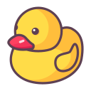
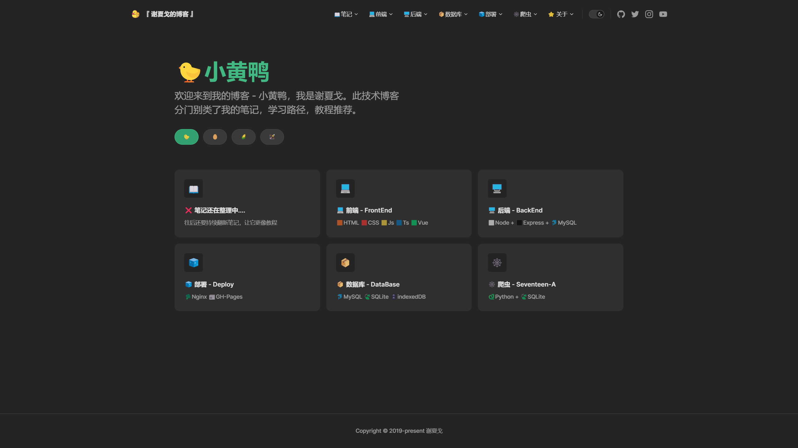

  

<h1 align="center">
🐤 小黄鸭 🐤
</h1>

My blog.

我的博客

<a href="zhishuchen.github.io/"><b>🐤进入我的博客： 小黄鸭 🐤</b></a> 

## 📖 介绍  

我受到[【TypeScript入门教程】](https://ts.xcatliu.com/)的启发  
希望我的博客能把我学到的知识用简单的话说出来。

就像【费曼学习法】，把学到的知识叙述出来，既能了解自己是否掌握，也可以给其他人看！

🐤小黄鸭 这个名字来源于一个故事：【[小黄鸭调试法](https://baike.baidu.com/item/%E5%B0%8F%E9%BB%84%E9%B8%AD%E8%B0%83%E8%AF%95%E6%B3%95/16569594)】

--- 

笔记/文章，内容与排版、样式持续更新中...
1. 【编程笔记】
2. 【WEB前端】
3. 【后端】
4. 【部署】
5. 【Python + 爬虫】

---
要在站一个完全不懂的角度去顾及初学者，是一件非常需要耐心和细心的事情。  ——  【知识诅咒】 

博客不只是做给自己看的笔记。  
每一个【关键词】【专业术语】都有可能让看这篇文章的人困惑一整天....    

在某些知识上我也是刚学的。但我还是希望我新学的知识能够把他讲明白，如果讲都讲不明白，我怎么能说我理解了它呢？

### 对于知识点：  
1. 我会先推荐一些相关文章  
2. 我会举例子以及说明相关专业术语

## 🖼️ 展示

  

